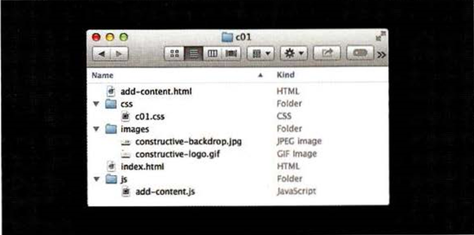
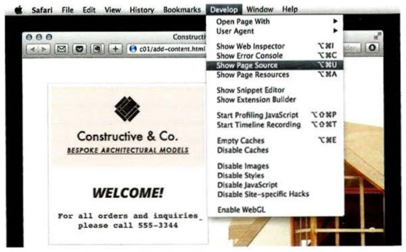
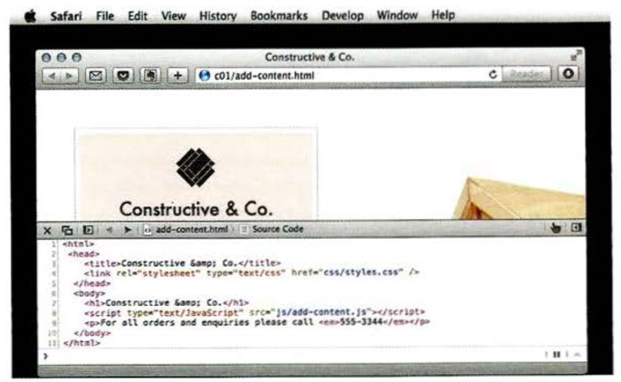

# CREATING A BASIC JAVASCRIPT

## JavaScript is written in plain text, just like HTML and CSS, so you do not need any new tools to write a script. This example adds a greeting into an HTML page. The greeting changes depending on the time of day.

> All steps:
1. Create a folder to put the example in called cOl, then start up your favorite code editor, and enter the text to the right.

*A JavaScript file is just a text file (like HTML and CSS files are) but it has a . j s file extension, so save this file with the name add-content.js*

```

var today= new Date(); 
var hourNow = today.getHours(); 
var greeting; 
if (hourNow > 18) { 
    greeting= 'Good evening!'; 
}else if (hourNow > 12) { 
    greeting = ' Good afternoon!'; 
}else if (hourNow > 0) { 
    greeting = 'Good morni ng!'; 
}else { 
    greeting = 'Welcome! ' ;
} 
document .write( ' <h3>' +greeting + ' </ h3>');

```

2. Get the CSS and images for this example from the website that accompanies the book: www.javascriptbook.com .

*To keep the files organized, in the same way that CSS files often live in a folder called styles or css, your JavaScript files can live in a folder called scripts,javascript,orjs. In this case, save your file in a folder called js*



*Here you can see the file structure that you will end up with when you finish the example. Always treat file names as being case-sensitive*

3. In your code editor, enter the HTML shown on the left. Save this file with the name add-content.html

*The HTML `<script>` element is used to load the JavaScript file into the page. It has an attribute called src, whose value is the path to the script you created*

```

<!DOCTYPE html>
 <html>
  <head>
   <title>Constructive &amp; Co.</ title>
   <link rel ="stylesheet" href="css/ cOl.css" />
  </head> 
  <body>
   <hl>Constructive &amp; Co. </hl> 
   <script src="js/ add-content.js"></ script> 
   <p>For all orders and i nquiries please call <em>SSS-3344</ em></ p>
  </body> 
</html>

```

4. Open the HTML file in your browser. You should see that the JavaScript has added a greeting (in this case, Good Afternoon!) to the page. (These greetings are coming from the JavaScript file; they are not in the HTML file.)


5. Once you have tried the example in your browser, view the source code for the page. (This option is usually under the View, Tools or Develop menu of the browser.




6. The source of the web page does not actually show the new element that has been added into the page; it just shows the link to the JavaScript file. 

*As you move through the book, you will see most of the scripts are added just before the closing `</body>` tag (this is often considered a better place to put your scripts).*



7. Finally, try opening the HTML file, removing the src attribute from the opening `<script>` tag, and adding the new code shown on the left between the opening `<script>` tag and the closing `</script>` tag. The s re attribute is no longer needed because the JavaScript is in the HTML page.

8. Open the HTML file in your web browser and the welcome greeting is written into the page.

*As you may have guessed, document. write() writes content into the document (the web page). It is a simple way to add content to a page, but not always the best. Chapter 5 discusses various ways to update the content of a page.*